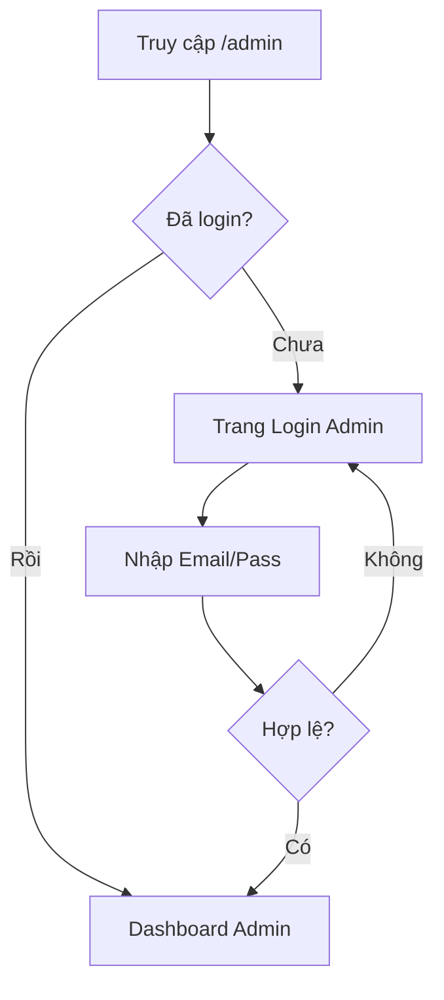

# BA — Giai đoạn 2: Auth Admin & Phân quyền Người dùng

## 1) TÓM TẮT 1 TRANG (Executive Summary)
- **Mục tiêu**: Thiết lập hệ thống đăng nhập, đăng xuất cho Admin và nền tảng tài khoản cho Người dùng (Customer) sử dụng chung một bảng dữ liệu.
- **Phạm vi In/Out**:
    - **In**: Migration bảng User, Seed Admin, Login/Logout Admin, Middleware bảo vệ route `/admin`.
    - **Out**: Đăng ký/Đăng nhập phía người dùng (Sẽ làm ở GĐ sau), Reset mật khẩu.
- **Phương án khuyến nghị**: Sử dụng `express-session` để quản lý phiên đăng nhập và `bcryptjs` để bảo mật mật khẩu. Phân biệt quyền bằng cột `role` trong bảng `User`.
- **Rủi ro lớn nhất**: Lộ Session Secret hoặc SQL Injection (Sẽ dùng Prisma và biến môi trường để giảm thiểu).
- **Tiêu chí nghiệm thu**: Admin đăng nhập thành công vào được Dashboard, sai mật khẩu báo lỗi, Logout ra được trang login.

## 2) BỐI CẢNH & MỤC TIÊU
- **Bối cảnh**: Dự án WebHoaQua cần bảo mật trang quản trị để quản lý hàng hóa.
- **Mục tiêu**: Đảm bảo chỉ người có tài khoản Admin mới có thể thay đổi dữ liệu. Đồng thời chuẩn bị sẵn cấu trúc để người dùng có thể tạo tài khoản sau này.

## 3) HIỆN TRẠNG TỪ CODEBASE
- **Module liên quan**: `src/app.js` (đã có session config), `prisma/schema.prisma` (đã có model User).
- **Constraints**: Node.js v21, Prisma v5.

## 5) SCREEN FLOW & USER FLOW

## 6) PHẠM VI (Scope)
- **In-scope**:
    - Migration Prisma cho bảng `User`.
    - Module `src/modules/admin/auth/`.
    - Login/Logout route.
    - `authMiddleware.js`.
- **Out-of-scope**:
    - Quản lý Profile user.
    - Phân quyền editor/manager (Chỉ làm Admin/Customer).

## 7) YÊU CẦU CHỨC NĂNG (FR)
- **Must**: Login Admin bằng Email/Password, Logout, Protection middleware cho các route bắt đầu bằng `/admin`.
- **Should**: Flash message thông báo khi đăng nhập lỗi hoặc đăng xuất thành công.

## 9) QUYỀN & TRẠNG THÁI (Permissions & States)
- **Roles**:
    - `ADMIN`: Toàn quyền trong `/admin`.
    - `CUSTOMER`: Quyền người dùng cuối (Sẽ dùng cho giỏ hàng/lịch sử đơn hàng ở GĐ sau).
- **User Status**: `active`, `inactive`.

## 10) MÔ HÌNH DỮ LIỆU / LƯỢC ĐỒ (Data Model)
- **Model User** (Cập nhật):
    - `role`: "admin" | "customer"
    - `email`: Duy nhất
    - `password_hash`: String (Bcrypt)

## 12) UI/UX BEHAVIOR
- **Login Form**: Validate email format, mật khẩu không được trống.
- **Trải nghiệm**: Chuyển hướng về `/admin` sau khi login thành công. Nếu cố tình vào `/admin/*` khi chưa login -> redirect về `/admin/login`.

## 15) PHƯƠNG ÁN TRIỂN KHAI + TRADEOFFS
- **Phương án**: Session-based Auth (Dùng `express-session` + `cookie-parser`).
- **Lý do**: Phù hợp với SSR (EJS), dễ triển khai và quản lý trạng thái login phía server hơn JWT trong trường hợp này.

## 17) DECISION LOG (Nhật ký quyết định)
- **Quyết định 1**: Sử dụng cột `role` trong cùng 1 bảng User thay vì tách bảng Admin/Customer. Lý do: Giảm phức tạp DB, dễ quản lý login tập trung.
- **Quyết định 2**: Khách hàng mua hàng không cần đăng nhập vẫn được hỗ trợ. Thông tin được lưu trực tiếp vào bảng `Order` (Snapshot thông tin khách).

## 20) DEEP THINKING RESULTS
1. **Devil's Advocate**: Nếu dùng session, khi scale ra nhiều server sẽ cần Redis để share session. Với project hiện tại (MVP), lưu session trong memory (hoặc file/Prisma store sau này) là chấp nhận được.
2. **Second-order effects**: Việc gộp bảng User giúp sau này Admin có thể "đóng vai" Customer để hỗ trợ khách hàng dễ hơn.
3. **Proactive proposal**: Nên thêm cột `last_login_at` để theo dõi truy cập Admin.

## 19) DEFINITION OF READY (DoR) cho bước /plan
- Đã chốt phương án Session Auth.
- Đã chốt cấu trúc Model User.
- Đã sẵn sàng các route `/admin/login`, `/admin/logout`.
