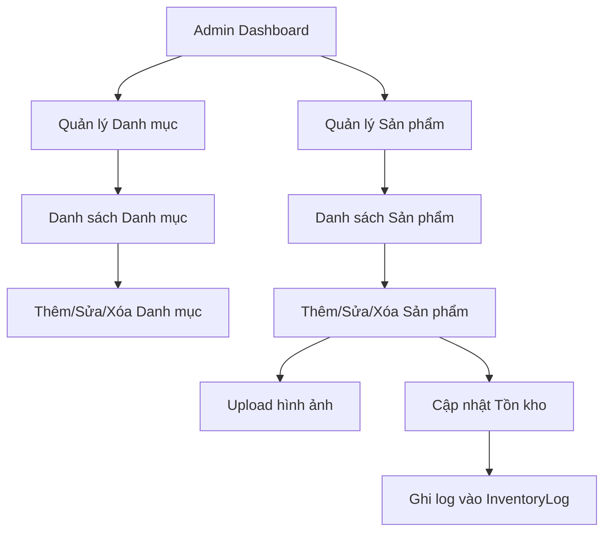

# BA — Giai đoạn 3: Quản lý danh mục và sản phẩm

## 1) TÓM TẮT 1 TRANG (Executive Summary)
- **Mục tiêu**: Xây dựng hệ thống quản lý danh mục (Categories) và sản phẩm (Products) hoàn chỉnh cho Admin, tích hợp upload hình ảnh qua Cloudinary và ghi log tồn kho cơ bản.
- **Phạm vi In/Out**:
    - **In**: CRUD Category, CRUD Product, Upload đa ảnh, Tự động tạo slug, Bộ lọc/Tìm kiếm trong Admin, Ghi log Inventory cơ bản, Seeding dữ liệu.
    - **Out**: Quản lý thuộc tính sản phẩm phức tạp (Variations), Quản lý kho nâng cao (phiếu nhập xuất chi tiết), Chương trình khuyến mãi nâng cao.
- **Phương án khuyến nghị**: Sử dụng kiến trúc Module-based hiện có. Tích hợp Multer + Cloudinary storage để xử lý ảnh. Dùng thư viện `slugify` để tạo slug.
- **Rủi ro lớn nhất**: Race condition khi cập nhật tồn kho từ nhiều nguồn (Order vs Admin manual adjust). Cách giảm thiểu: Sử dụng Transaction trong Prisma.
- **Tiêu chí nghiệm thu**: Admin có thể tạo Category/Product với đầy đủ ảnh, slug hợp lệ, và có log Inventory tương ứng khi thay đổi số lượng.

## 2) BỐI CẢNH & MỤC TIÊU
- **Bối cảnh vận hành**: Admin cửa hàng hoa quả cần cập nhật thông tin sản phẩm hàng ngày, điều chỉnh giá và kiểm tra tồn kho.
- **Mục tiêu kinh doanh**: Đưa được danh mục sản phẩm lên hệ thống để chuẩn bị cho giai đoạn Public Website (Frontend).
- **Stakeholders**: Admin, Store Staff.

## 3) HIỆN TRẠNG TỪ CODEBASE
- **Module liên quan**: `src/modules/categories`, `src/modules/products`, `src/modules/inventory`.
- **Luồng hiện trạng**: Các file hiện tại đang để trống, chỉ có schema Prisma đã định nghĩa đầy đủ.
- **Vấn đề chính**: Chưa có giao diện và route xử lý cho các module này.
- **Constraints kỹ thuật**: 
    - Techstack: Express.js, EJS, Prisma (PostgreSQL).
    - Image Host: Cloudinary.

## 4) PERSONAS / USER JOURNEYS
- **Persona**: Admin cửa hàng.
- **Mục tiêu**: Thêm mới một sản phẩm "Táo Envy" vào danh mục "Trái cây nhập khẩu Mỹ", upload 3 ảnh, set giá và số lượng ban đầu là 100kg.
- **Journey**: Admin Login -> Categories -> Add New Category -> Products -> Add New Product -> Upload Images -> Save.

## 5) SCREEN FLOW & USER FLOW


## 6) PHẠM VI (Scope)
- **In-scope**:
    - Danh sách categories (Phân cấp cha-con cơ bản qua parent_id).
    - CRUD categories với ảnh đại diện.
    - Danh sách products với lọc theo category, status, search name.
    - CRUD products với SKU, giá, xuất sứ, đơn vị tính...
    - Upload nhiều ảnh cho sản phẩm, chọn 1 ảnh làm thumbnail.
    - Auto-slug khi lưu name.
    - Ghi log nhập/xuất kho khi admin chỉnh sửa `stock_quantity`.
- **Out-of-scope**:
    - Phân trang Category (do dự kiến số lượng ít).
    - Chỉnh sửa ảnh (Crop/Rotate) sau khi upload (chỉ resize tự động bằng Cloudinary).
    - Quản lý Batch/Expiry date (Hạn sử dụng).

## 7) YÊU CẦU CHỨC NĂNG (FR)
```
TYPE        STATUS   MÔ TẢ
----------  -------  ----------------------------------------
MUST        TODO     CRUD Category (Name, Slug, Image, Parent, Status)
MUST        TODO     CRUD Product (Name, SKU, Price, Unit, Origin, Stock)
MUST        TODO     Upload ảnh lên Cloudinary (Category 1, Product n)
MUST        TODO     Tự động gen Slug (tiếng Việt có dấu -> ko dấu)
MUST        TODO     Ghi log InventoryLog khi thay đổi stock_quantity
SHOULD      TODO     Bộ lọc sản phẩm theo Category và Tình trạng (Publish/Hide)
SHOULD      TODO     Tìm kiếm sản phẩm theo Name/SKU
```

## 8) YÊU CẦU PHI CHỨC NĂNG (NFR)
- **Bảo mật**: Chỉ admin được phép truy cập CRUD qua middleware `isAdmin`.
- **Hiệu năng**: Resize ảnh về chuẩn (VD: 800x800) trước khi lưu Cloudinary để tiết kiệm băng thông.
- **Tương thích**: Slug phải unique và thân thiện với SEO.

## 9) QUYỀN & TRẠNG THÁI (Permissions & States)
- **Roles**: Admin (Toàn quyền).
- **Product Status**:
    - `published`: Hiển thị công khai.
    - `draft`: Nháp, chỉ admin thấy.
    - `out_of_stock`: Hết hàng (tự động hoặc manual).

## 10) MÔ HÌNH DỮ LIỆU / LƯỢC ĐỒ (Data Model)
- Sử dụng bảng `Category`, `Product`, `ProductImage`, `InventoryLog` trong schema Prisma hiện tại.
- Cần lưu ý `onDelete: Cascade` cho `ProductImage` khi xóa `Product`.

## 11) API CONTRACT / INTEGRATIONS
- **Integrations**: Cloudinary API via SDK.
- **Routes (Admin Site)**:
    - `GET /admin/categories`: Danh sách.
    - `POST /admin/categories/create`: Xử lý thêm.
    - `GET /admin/products`: Danh sách + Search/Filter.
    - `POST /admin/products/create`: Xử lý thêm (có Multer).

## 12) UI/UX BEHAVIOR
- **Danh sách Product**: Hiển thị ảnh thumbnail, Tên, SKU, Category, Giá, Tồn kho, Trạng thái.
- **Form Product**: Sử dụng thư viện chọn tags hoặc nhiều ảnh mượt mà. Đơn vị tính (kg, thùng, hộp) dùng dropdown.

## 13) EDGE CASES & FAILURE MODES
- **Duplicate SKU/Slug**: Trả về lỗi validate ở form.
- **Upload lỗi**: Xóa ảnh tạm, báo lỗi cho user.
- **Xóa Category đang có Product**: Cảnh báo hoặc không cho xóa (Cần define rule: Set parent_id or reject). *Quyết định: Block xóa nếu đang có sản phẩm hoặc chuyển sản phẩm sang danh mục "Chưa phân loại".*

## 14) TIÊU CHÍ NGHIỆM THU (Acceptance Criteria)
- AC1: Upload Category thành công với 1 ảnh.
- AC2: Create Product với SKU đã tồn tại báo lỗi "SKU đã được sử dụng".
- AC3: Slug tự động sinh: "Táo Envy Mỹ" -> "tao-envy-my".
- AC4: Khi sửa stock_quantity từ 10 thành 15, bảng InventoryLog có 1 dòng "adjust" +5 quantity.

## 15) PHƯƠNG ÁN TRIỂN KHAI + TRADEOFFS
- **Phương án 1 (Minimal)**: Chỉ CRUD basic, upload ảnh thô.
- **Phương án 2 (Standard)**: CRUD + Image resize + Inventory Log + Search/Filter (Khuyến nghị).
- **Phương án 3 (Advance)**: Thêm bulk upload Excel, Dashboard repo.

## 17) DECISION LOG
- Chốt dùng `slugify` cho slug.
- Chốt block xóa Category nếu có sản phẩm để đảm bảo data integrity.
- Tồn kho ban đầu được coi là một bản ghi `import` trong InventoryLog.

## 18) ASSUMPTIONS + QUESTIONS
- **Assumptions**: 
    1. Cloudinary account đã active và có API keys.
    2. Một sản phẩm chỉ thuộc về 1 danh mục chính (theo schema `category_id`).
- **Questions**: 
    1. Có cần hỗ trợ Đa ngôn ngữ (I18n) cho tên sản phẩm không? (Tạm thời: Không).

## 19) DEFINITION OF READY (DoR)
- Đã chốt Schema Prisma.
- Đã có config Cloudinary.
- Đã có middleware `isAdmin`.

## 20) DEEP THINKING RESULTS
### A) Phản biện (Devil's Advocate):
1. **"Nếu xóa Category cha, các con sẽ đi đâu?"** -> Cần xử lý logic set null `parent_id` hoặc delete recursive. *Quyết định: Set null parent_id cho các con khi cha bị xóa.*
2. **"Nếu upload 10 ảnh nặng cùng lúc, server có bị treo không?"** -> Cần giới hạn size upload qua Multer và số lượng ảnh tối đa (VD: 5-10 ảnh).
3. **"Nếu user đổi tên sản phẩm liên tục, slug có đổi theo không?"** -> Nên để option giữ nguyên slug cũ để không gãy link SEO, hoặc cập nhật và redirect 301. *Quyết định: Chỉ gen slug khi tạo mới hoặc khi user chủ động tick "Cập nhật slug".*

### B) Second-order effects:
- Thay đổi danh mục/sản phẩm ảnh hưởng trực tiếp đến Search Index (nếu có sau này) và Giỏ hàng hiện tại của khách hàng.

### C) Consistency check:
- Follow module pattern: `src/modules/{feature}/{controller|service|route|validation}.js`.

### D) Đề xuất chủ động:
- Thêm thuộc tính `original_url` của ảnh để lưu ảnh gốc, và `thumbnail_url` để hiển thị trong list.
- Thêm chức năng "Duplicate Product" để admin tạo nhanh sản phẩm tương tự.

---
**Review checklist**: 00_requirements_log.md đã cập nhật.
