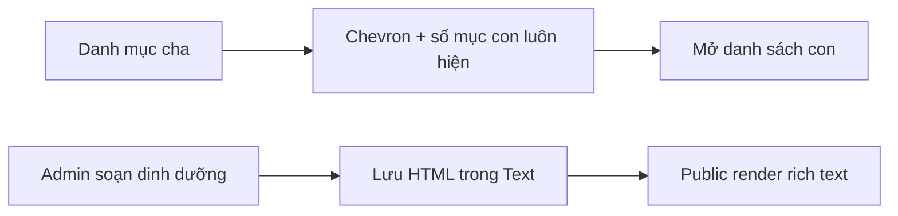

# BA Addendum v5 — Nâng UI danh mục con và thông tin dinh dưỡng
- Ngày: 2026-07-29 10:00
- Tham chiếu: `00_ba.md`, các BA/addendum trước
- Lý do bổ sung: yêu cầu UI mới ngày 2026-07-29

## 1) Tóm tắt
Làm rõ danh mục cha có mục con ngay cả trước hover; đưa phần dinh dưỡng lên cùng chuẩn rich text với mô tả ở admin và public. Không đổi schema/API.

## 2) Bối cảnh & mục tiêu
Khách hàng cần nhận biết cấu trúc bộ lọc và đọc dữ liệu dinh dưỡng nhanh hơn; admin cần trình bày được tiêu đề, danh sách và nhấn mạnh.

## 3) Hiện trạng codebase
`shop.ejs` chỉ mở `.sub-categories-list` khi hover/active. `_count.products` của cha không gồm con. Dinh dưỡng dùng textarea và đổi newline thành ` `, trong khi mô tả dùng Quill.

## 4) Persona / journey
Khách mở trang sản phẩm → nhận biết nhóm có mục con → mở bằng click/keyboard hoặc hover → lọc. Admin tạo/sửa → soạn dinh dưỡng rich text → khách xem trong tab đẹp, rõ.

## 5) Screen flow

## 6) Phạm vi
In-scope: shop sidebar, tổng số sản phẩm theo nhóm, create/edit admin, detail public, tương thích plain text cũ. Out-of-scope: schema mới, bảng dinh dưỡng có cấu trúc, sanitization toàn hệ thống.

## 7) Yêu cầu chức năng
- Must: danh mục có con luôn có chevron và số mục con; click được; active tự mở.
- Must: số sản phẩm cha phản ánh cả nhóm cha/con.
- Must: dinh dưỡng dùng rich text ở create/edit và render rich text ở public.
- Should: dữ liệu plain text cũ vẫn đọc/chỉnh được.
- Won't: đổi contract DB/API.

## 8) Phi chức năng
Responsive, hỗ trợ bàn phím/ARIA, không tăng query DB, giữ giao diện Bootstrap/brand hiện hữu.

## 9) Quyền & trạng thái
Admin mới sửa nội dung; public chỉ đọc. Trạng thái đóng/mở, active, empty đều phải rõ.

## 10) Dữ liệu
Giữ `Product.nutritional_info` kiểu Text. HTML Quill lưu trực tiếp như `description`.

## 11) API
Không thay đổi endpoint hay payload key.

## 12) Validation
Không thêm validation nghiệp vụ; editor rỗng được phép.

## 13) UI states
Closed: vẫn thấy badge số con + chevron. Expanded/hover/active: hiện con và xoay chevron. Empty nutrition: thông báo đang cập nhật.

## 14) Acceptance criteria
1. Không hover vẫn biết danh mục nào có con.
2. Nút mở rộng không submit form; radio danh mục vẫn lọc.
3. Tổng nhóm bằng sản phẩm cha cộng sản phẩm con.
4. Cả create/edit có toolbar dinh dưỡng.
5. Detail giữ định dạng rich text và plain text cũ.

## 15) Tương thích
Không migration; trình duyệt hiện đại hỗ trợ Quill/Bootstrap.

## 16) Quan sát
Không cần log mới vì thay đổi presentation-only.

## 17) Rollback
Revert các view và phép cộng `groupProductCount`; dữ liệu Text vẫn tương thích.

## 18) Giả định
Cây danh mục hiện hỗ trợ hai cấp; admin là nguồn nội dung tin cậy như trường description.

## 19) Definition of Ready
File liên quan, hành vi và tiêu chí nghiệm thu đã xác định; không còn quyết định làm thay đổi scope.

## 20) Deep Thinking
- 10x dữ liệu: phép reduce chạy trên danh sách đã query, không thêm N+1.
- Misuse: click chevron tách khỏi label để tránh lọc ngoài ý muốn.
- Must thiết yếu: dấu hiệu con và rich text; animation phức tạp không cần thiết.
- Ảnh hưởng ngoài scope: dữ liệu HTML cần cùng chính sách sanitization với description.
- Đề xuất bổ sung (không bắt buộc): bổ sung HTML sanitization tập trung cho cả hai trường.
- Không cần feature flag/canary; rollback là diff view/controller nhỏ.

## Tác động đến Plan/Slice hiện có
Thêm S40 (bộ lọc danh mục) và S41 (dinh dưỡng rich text).
